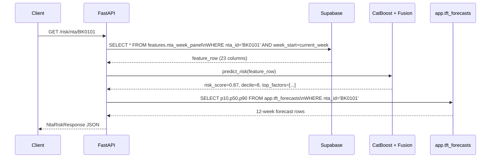
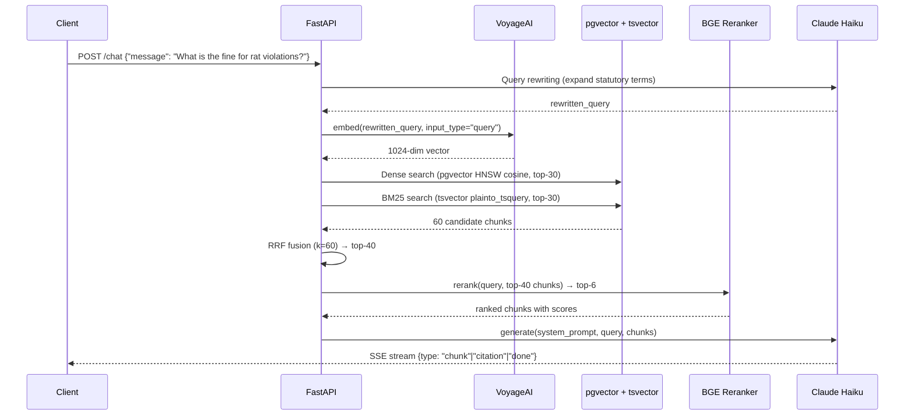

# Architecture

## System Overview

```mermaid
flowchart TD
    subgraph Sources["Raw Data Sources"]
        S1[DOHMH Rodent Inspections\nSocrata p937-wjvj]
        S2[NYC 311 Rodent Complaints\nSocrata erm2-nwe9]
        S3[Restaurant Inspections\nSocrata 43nn-pn8j]
        S4[DOB Permits\nipu4-2q9a + rbx6-tga4]
        S5[MapPLUTO\nNYC DCP]
        S6[Weather\nMeteostat GHCN-Daily]
        S7[Sentinel-2 L2A\nMicrosoft Planetary Computer]
        S8[NYC Health Code\nPDFs: Article 151, HMC, RCNY]
    end

    subgraph Ingest["Ingest Layer  ·  raw schema"]
        I1[ingest_rodent_inspections.py]
        I2[ingest_311.py]
        I3[ingest_restaurant_inspections.py]
        I4[ingest_dob_permits.py]
        I5[ingest_pluto.py]
        I6[ingest_weather.py]
        I7[ingest_sentinel2.py]
        I8[ingest_health_code_*.py]
    end

    subgraph Features["Feature Engineering  ·  features schema"]
        F1[build_panel.py\nnta_week_panel]
        F2[build_spatial_lags.py\nqueen contiguity]
        F3[build_regime_indicators.py\npolicy booleans]
        F4[clay_embeddings.py\nClay v1.5 → 32-dim PCA]
    end

    subgraph Models["Model Training  ·  ml/artifacts"]
        M1[CatBoost\nPrimary tabular]
        M2[LightGBM\nAblation]
        M3[Logistic Regression\nBaseline]
        M4[TabPFN v2\nPer-borough small-N]
        M5[TFT\nDarts 12-week forecast]
        M6[Chronos-2\nFine-tuned challenger]
        M7[Fusion Meta-Learner\nCalibrated LR over OOF]
    end

    subgraph DB["Supabase Postgres\nPostGIS + pgvector + pg_trgm"]
        DB1[(raw schema)]
        DB2[(features schema)]
        DB3[(app schema\nRAG chunks, predictions,\nchat sessions, forecasts)]
    end

    subgraph RAG["RAG Pipeline"]
        R1[Chunking\nSection-aware hierarchical]
        R2[Embeddings\nvoyage-3-large + BGE-M3]
        R3[Retrieval\nBM25 + dense + RRF]
        R4[Reranker\nBGE v2-M3 self-hosted]
        R5[Generation\nClaude Haiku 4.5 / Groq fallback]
    end

    subgraph API["FastAPI Backend  ·  Render"]
        A1[GET /risk/nta/{id}\nrisk score + SHAP + forecast]
        A2[GET /risk/map\nchoropleth data]
        A3[POST /chat\nSSE RAG chat]
        A4[GET /health]
        A5[GET /risk/nta/{id}/narrative\nLLM summary]
    end

    subgraph Frontend["Next.js Frontend  ·  Vercel"]
        W1[/ Landing + choropleth map]
        W2[/nta/id Detail + forecast chart]
        W3[/chat RAG chat]
        W4[/about Methodology]
    end

    subgraph Obs["Observability"]
        O1[Sentry errors]
        O2[Phoenix OTLP dev]
        O3[JSONL trace sink]
        O4[Better Stack uptime]
    end

    S1 --> I1 --> DB1
    S2 --> I2 --> DB1
    S3 --> I3 --> DB1
    S4 --> I4 --> DB1
    S5 --> I5 --> DB1
    S6 --> I6 --> DB1
    S7 --> I7
    S8 --> I8 --> DB3

    DB1 --> F1 --> DB2
    DB2 --> F2 --> DB2
    DB2 --> F3 --> DB2
    I7 --> F4 --> DB2

    DB2 --> M1 & M2 & M3 & M4 & M5 & M6
    M1 & M5 & M6 & F4 --> M7

    DB3 --> R1 --> R2 --> DB3
    DB3 --> R3 --> R4 --> R5

    M1 --> A1
    M7 --> A1
    DB2 --> A1
    DB3 --> A1
    R3 & R4 & R5 --> A3
    A1 --> A5

    A1 & A2 & A3 & A4 & A5 --> Frontend
    API --> O1 & O2 & O3
    Frontend --> O1 & O4
```

---

## Data Flow: Risk Prediction Request



---

## Data Flow: RAG Chat Request



---

## Deployment

```
┌──────────────────────────────────────────────────────┐
│                    Internet                           │
└────────────────┬─────────────────┬───────────────────┘
                 │                 │
         ┌───────▼──────┐  ┌───────▼──────┐
         │    Vercel    │  │    Render    │
         │  Next.js 16  │  │  FastAPI     │
         │  *.vercel.app│  │  *.onrender  │
         └───────┬──────┘  └──────┬───────┘
                 │                │
                 └───────┬────────┘
                         │
              ┌──────────▼──────────┐
              │  Supabase Free      │
              │  Postgres 15        │
              │  PostGIS + pgvector │
              │  + pg_trgm          │
              └─────────────────────┘
```

---

## Model Lineage

| Model | Type | Input | Output | Notes |
|---|---|---|---|---|
| CatBoost | Gradient boosted trees | 23 NTA-week features | Calibrated P(active rat signs) | Primary tabular model |
| LightGBM | Gradient boosted trees | 23 NTA-week features | Calibrated probability | Ablation |
| Logistic Regression | Linear | 23 NTA-week features | Calibrated probability | Baseline |
| TabPFN v2 | Transformer in-context | Per-borough subsets ≤10k rows | Calibrated probability | Small-N complement |
| TFT | Temporal Fusion Transformer | 52-week context + covariates | p10/p50/p90 12-week forecast | Probabilistic time series |
| Chronos-2 | LM-style sequence model | Count history | p10/p50/p90 12-week forecast | Challenger; different inductive bias |
| Fusion LR | Stacked meta-learner | CatBoost + TFT + Chronos OOF + Clay PCA | Calibrated ensemble probability | Primary production model |
| Clay v1.5 | MAE satellite encoder | 7-band Sentinel-2 patch 256×256 | 768-dim → 32-dim PCA | Static spatial features |
